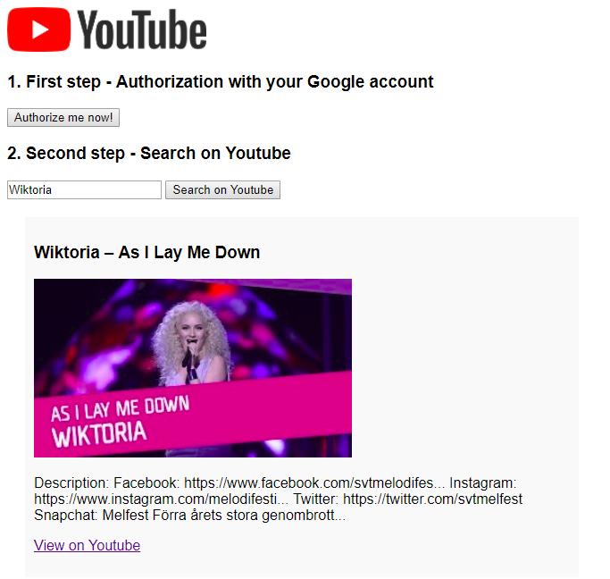

# Advance JS - GYoutubeSearch
* The simple example web app which using Youtube API
* Versions:
    * Pure JavaScript version ([`purejs branch`]() - [Demo](https://nguyenkhois.github.io/advjs-youtubesearch/demo/purejs/))
    * jQuery version (master branch - [Demo](https://nguyenkhois.github.io/advjs-youtubesearch/public/))

## Screenshot

## Using
* Please read carefully before testing this example:
    * Create and sign in your account on Google.
    * Get your `client_id` and config `redirect_uri` in your Dashboard on [Google Developers](https://console.developers.google.com/) and change these variables values in `src/index.js` before you rebuild this app for end result.
    * You must create an app and config your API on Google before using this example. View more information on [Google Developers](https://developers.google.com/youtube/v3/getting-started)
* [Read more about jQuery - Ajax](http://api.jquery.com/jquery.ajax/)

## Changelog
### Version beta 2 (2018-04-08)
* Refactored from jquery to pure JavaScript
* Improved JS code
### Version beta 1 (2018-04-03)
* Completed requirements for this example
    * Using Google Youtube v3 API
    * Authorization
    * Get videos from API
    * A link to Youtube for viewing
    
## References for API
* [YouTube Data API Overview](https://developers.google.com/youtube/v3/getting-started)
* [Using OAuth 2.0 for JavaScript Web Applications](https://developers.google.com/youtube/v3/guides/auth/client-side-web-apps)
* [Search](https://developers.google.com/youtube/v3/docs/search)
* [
Search: list](https://developers.google.com/youtube/v3/docs/search/list)
* [Brand Resources](https://www.youtube.com/yt/about/brand-resources/#logos-icons-colors)